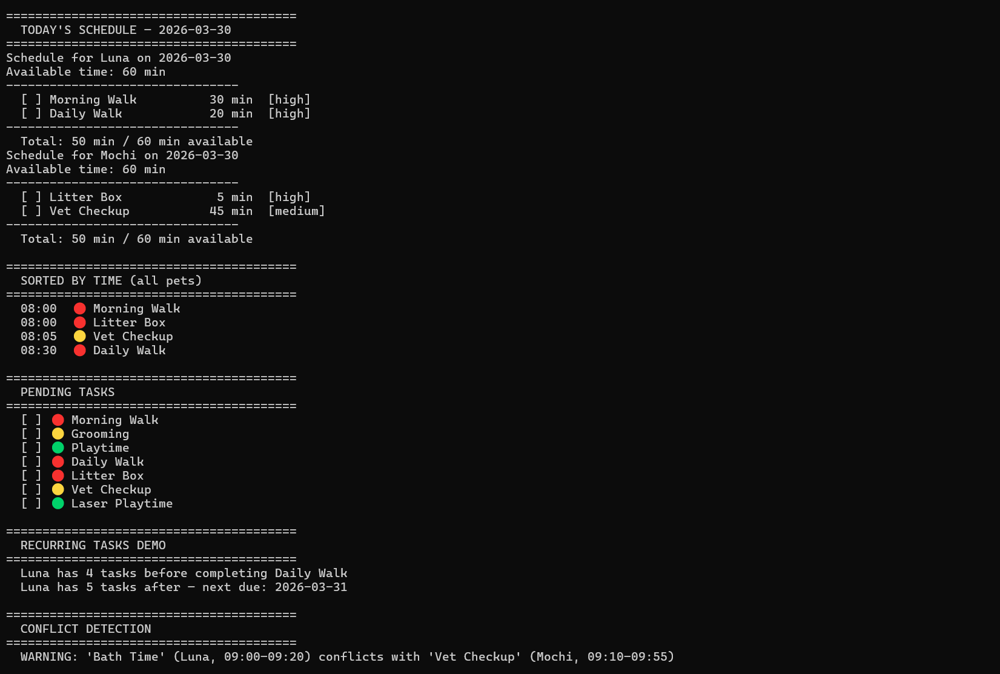

# PawPal+ (Module 2 Project)

You are building **PawPal+**, a Streamlit app that helps a pet owner plan care tasks for their pet.

## Scenario

A busy pet owner needs help staying consistent with pet care. They want an assistant that can:

- Track pet care tasks (walks, feeding, meds, enrichment, grooming, etc.)
- Consider constraints (time available, priority, owner preferences)
- Produce a daily plan and explain why it chose that plan

Your job is to design the system first (UML), then implement the logic in Python, then connect it to the Streamlit UI.

## What you will build

Your final app should:

- Let a user enter basic owner + pet info
- Let a user add/edit tasks (duration + priority at minimum)
- Generate a daily schedule/plan based on constraints and priorities
- Display the plan clearly (and ideally explain the reasoning)
- Include tests for the most important scheduling behaviors

## Features

- **Priority-based scheduling** — Tasks are sorted high → medium → low and packed into the owner's daily time budget; any task that doesn't fit is dropped rather than truncated.
- **Chronological sorting** — `sort_tasks_by_time` orders any flat list of tasks by their assigned start time using lexicographic comparison on zero-padded `"HH:MM"` strings. Tasks with no start time are pushed to the end.
- **Conflict detection** — `detect_conflicts` checks every pair of scheduled tasks for overlapping time windows using integer-minute arithmetic. Flags both same-pet and cross-pet collisions and returns plain-English warning strings.
- **Daily and weekly recurrence** — Completing a recurring task automatically creates the next occurrence with the due date advanced by one day or one week, keeping the original task's name, duration, priority, and category.
- **Flexible filtering** — `filter_tasks` lets you query tasks across all schedules by pet name, completion status, or both combined.
- **Multi-pet scheduling** — `build_owner_schedules` traverses the full owner → pets hierarchy and produces one `Schedule` per pet, splitting the owner's available time evenly across pets.

## Smarter Scheduling

Beyond the basic priority-sort planner, the scheduler includes four algorithmic features:

### Sort by time
`sort_tasks_by_time(tasks)` returns a chronologically ordered list using a lambda key on `"HH:MM"` strings. Because times are zero-padded, lexicographic order equals chronological order — no `datetime` parsing needed. Tasks with no start time are pushed to the end via a `"99:99"` sentinel.

### Filter by pet or status
`filter_tasks(schedules, *, pet_name=None, completed=None)` accepts any combination of keyword filters. Omit a filter to match everything; combine both to narrow to, say, one pet's pending tasks only. The function reads from each pet's raw task list so completed tasks remain visible even though the generated plan excludes them.

### Recurring tasks
`Task` supports a `recurrence` field (`"daily"` or `"weekly"`). When `mark_complete()` is called on a recurring task, it returns a new `Task` instance with `completed=False` and `due_date` advanced by `timedelta(days=1)` or `timedelta(weeks=1)`. `Pet.complete_task(name, on_date)` handles this automatically — it marks the original done and appends the next occurrence to the pet's task list in one call.

### Conflict detection
`detect_conflicts(schedules)` checks every pair of scheduled tasks for overlapping time windows using integer-minute arithmetic (`a_start < b_end and b_start < a_end`). It covers both same-pet and cross-pet collisions and returns a list of human-readable warning strings — it never raises an exception. An empty list means no conflicts were found.

## Testing PawPal+

### Run the tests

```bash
python -m pytest
```

### What the tests cover

| Area | What is verified |
|---|---|
| **Sorting** | `sort_tasks_by_time` returns tasks in chronological order; unscheduled tasks (no `start_time`) are pushed to the end |
| **Filtering** | Tasks can be filtered across schedules by pet name and/or completion status |
| **Scheduling** | `Schedule.generate_plan` fits tasks within available time and assigns sequential start times |
| **Recurring tasks** | Completing a daily task produces a new task with `due_date + 1 day` and `completed=False`; `Pet.complete_task` appends it automatically |
| **Conflict detection** | Overlapping time windows are flagged; back-to-back tasks (no overlap) produce no warnings |

### Confidence level

**4 / 5 stars**

Core scheduling behaviors — time conflicts, filtering, recurring tasks, and sorting — are all covered with both positive cases and edge cases (e.g. back-to-back tasks, unscheduled tasks). The main gap is integration-level testing of the full `build_owner_schedules` flow and the Streamlit UI layer.

## Demo
<a href="/course_images/ai110/your_screenshot_name.png" target="_blank"></a>

## Getting started

### Setup

```bash
python -m venv .venv
source .venv/bin/activate  # Windows: .venv\Scripts\activate
pip install -r requirements.txt
```

### Suggested workflow

1. Read the scenario carefully and identify requirements and edge cases.
2. Draft a UML diagram (classes, attributes, methods, relationships).
3. Convert UML into Python class stubs (no logic yet).
4. Implement scheduling logic in small increments.
5. Add tests to verify key behaviors.
6. Connect your logic to the Streamlit UI in `app.py`.
7. Refine UML so it matches what you actually built.
